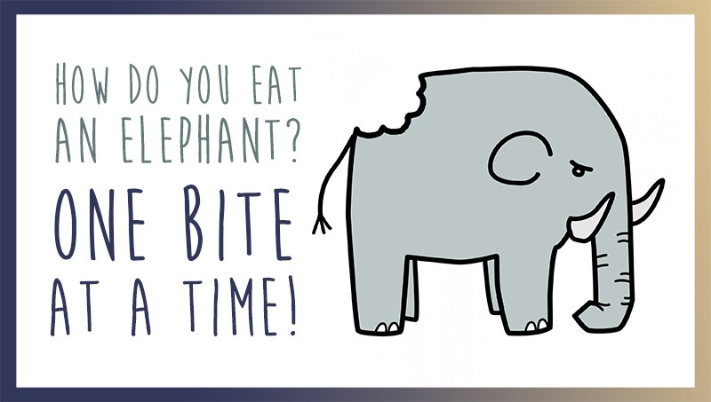

# Web One Bite At a Time !

The Web is huge there is so many thinks to learn and try.
How to take on such a colossal task? 

The same way you eat an elephant One bite at a time.

## Repo Goal !

The Goal of this repository is to try build small functionality of web technology
in pure HTML5, CSS3 and the latest JavaScript.

This idea have been inspire by Wesbos [JavaScript 30 Challenge] (https://javascript30.com/).

## Interesting Bite

  inspiration

    [Quackit HTML5 tags] (https://www.quackit.com/html_5/tags/) 

    [Tutorial Republic] (https://www.tutorialrepublic.com/html-reference/html5-tags.php)

    [MDN HTML elements reference] (https://developer.mozilla.org/en-US/docs/Web/HTML/Element)
    
    [html5 cmarix cheat sheet] (http://www.cmarix.com/Infographics-HTML5-Cheat-Sheet/) 

    [MDN Web APIs reference] (https://developer.mozilla.org/en-US/docs/Web/Reference/API)

    [MDN WebAPI] (https://developer.mozilla.org/en-US/docs/WebAPI)

    [MDN Web APIs] (https://developer.mozilla.org/en-US/docs/Web/API)

    [Chrome Web APIs] (https://developer.chrome.com/apps/api_other)

* Bite All transformation that can be apply to images : blur, .....

* Bite svg

* Bite audio tag

* Bite application cache

* Bite geolocalisation

* Bite Device Orientation Events

* Bite local storage

* Bite notifications

* Bite create custom RSS feed

* Bite CSS Object Model

* Bite webGL

* Bite pointer lock

* Bite web database

* Bite Accelerated Mobile Project (AMP)  

* Bite Services workers

* Bite Web Sharing API

## Ressources 

* [Mozilla Developer Network] (https://developer.mozilla.org/en-US/) 

* [Google Web Fondamental] (https://developers.google.com/web/)