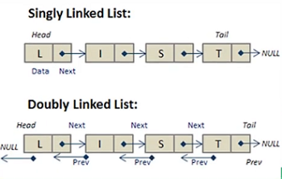

# Data structures

In computer science a data structure is a data organization and storage format that enables efficient access and modification.

Developer are interested in time and space complexity associated with the fourth fundamental operations: `Access`, `Insertion`, `Deletion` And `search`.

A data structure is a way of organizing and storing data in a computer computer so that it can be access and use efficiently. It's the defined relationship between the data and the operation that can be performed on the data.

**Reference**

- [Data Structure](https://www.geeksforgeeks.org/data-structures/)
- [Data structure in Javascript](https://www.geeksforgeeks.org/courses/data-structures-and-algorithms-in-javascript?utm_source=geeksforgeeks&utm_medium=article_bottom_text_dsa&utm_campaign=courses)

## Why data a structure

- **Efficient data management**: They enable efficient storage and retrieval of data, Reducing processing time and improving performance.

- **Data organization**: They organize data and all logical matter, making it easier to understand and access.

- **Data obstruction**: They can hide the implementation detail of the data storage.

- **Reusability**: Common data structure can be used in multiple application, saving time and effort and development.

- **Algorithm optimization**: The choice of the appropriate date structure can Significantly impact the efficiency of algorithm that operate on the data.

## Classification of the structure

- **Linear data structures**: Store data in a sequential order is allowing for easy insertion and deletion operation. Example: Array, linked list, stack And queues.

- **Non-linear data structure**: These structures store data in a hierarchical, or interconnected manner, this allowing for more complex relationships between data elements. Example: Trees, Graphs and hash tables.

### Example of data structures

- Array
- Linked List
- Queue
- Stack

- Maps (Dictionary)
- Hash maps

- Binary Tree
- Binary Search
- Tree
- Heap
- Hashing
- Graph
- Matrix
- Misc
- Advanced Data Structure

## Linear Data structures

Store data in a sequential order is allowing for easy insertion and deletion operation. Example: Array, linked list, stack And queues.

### Advantage of linear data structures

- **Efficient data access**: Element can be easily accessed by the position in the sequence.

- **Dynamic sizing**: Linear data, structure and dynamically, adjust their size as element or added or removed.

- **Ease of implementation**: Linear data structure can be easily implemented using array or linked lists.

- **Versatility**: Linear data structure can be used for searching sorting and manipulation of data.

- **Simple algorithms**: Riddance use in linear data structure are simple and straightforward.

### This advantage of linear data structures

- **Limited data access**: Accessing elements not sorted at the end, or at the beginning of a sequence can be time consuming.

- **Memory overhead**: Maintaining the links between elements in the linked lists and pointers in stack in queues can consume additional memory.

- **Complex algorithms**: Some algorithms use it in linear data structure, such as searching and sorting can be complex and time-consuming.

- **Inefficient use of memory**: Linear data structure in result in any efficient use of memory if there's a gap in memory location.

- **Unsuitable for certains operations**: Linear data structure may not be suitable for operation that require constant Random access to elements, such as searching for an element in a large dataset.

### Array

Array is a collection of element stored in a continuous memory locations. Array data structure can be fixed length or dynamic length. Array use zero base index.

Random access: Array provide constant time `O(1)`, access to elements.

```ts
const newArray = ["a", "b", "c", "d"];
newArray.push("Seb");
```


### Multidimensional Array

It is possible to create a two-dimensional array, also refer as a matrix or a array of array.

### Linked list

A linked list is a linear data structure which look like a chain of node where each note contains a data value and a reference link to the next node in the list.

Unlike array Linked list element are not stored in a continuous location in memory. Link list is a dynamic data structure that came allocate and deallocate memory at runtime.

- **Node**: Each element in a link list is represented by a node, Which contain two component.
- **Data**: The actual data or value associate with the element.
- **Next Pointer (Link)**: Reference to the next node.

The first known is called the **head**. It serve as the starting point for travelling the list.
Last node is called the **tail**. The value of the link is NULL.

#### Operations

- **Accessing Elements**: Accessing a specific element in a linked list take O(n) time.

- **Searching**: Searching of a node in linked list O(n) time as whole list needs to traversed in worst case.

- **Insertion**: Insertion takes O(1) time if we at the position where we have to insert an element.

- **Deletion**: Delete takes O(1) time if we know the position of the element to e deleted.



#### Singly Linked Lists

The singly Linked list as every node store the address of the next node in the list, the last node has thr reference as NULL.

[Single linked list](https://medium.com/swlh/singly-linked-list-in-javascript-a0e58d045561)

[Github Linked Lists](<https://github.com/Apress/js-data-structures-and-algorithms/blob/master/Chapter13(LL).js>)

```ts
function SinglyLinkedListNode(data) {
  this.data = data;
  this.next = null;
}

function SinglyLinkedList() {
  this.head = null;
  this.size = 0;
}

SinglyLinkedList.prototype.isEmpty = function () {
  return (this.size = 0);
};

SinglyListList.prototype.insert = function (value) {
  // if first node
  if (this.head === null) {
    this.head = SinglyLinkedListNode(value);
  } else {
    let temp = this.head;
    this.head = new SinglyLinkedListNode(value);
    this.head.next = temp;
  }
  this.size++;
};
let sll1 = new SinglyLinkedList();
sll1.insert(1);
```

#### Doubly Linked Lists

Doubly linked list each node has two pointers, one pointer to the next note and one pointer to the previous node. This bidirectional singly linked list allowing for efficient traversal in both direction.

#### Circular Linked Lists

A circular Linked list is the type of Linked list in which the first and the last note are also connected to each other to form a circle. There is not NULL link.

#### Advanced Data Structure

### Stack

A stack is a linear data structure in which only the last inserted element can be removed and access. That follow the last-In-First-Out(LIFO) principle.

Stack is great because it is fast, Since it is now, then the last element is to be removed, The look up and insertion happened in a constant time of `O(1)`.


#### Stack Operations

- **push()**: Element is added on top of the stack.
- **pop()**: An element is removed from the top of the stack.
- **top() || peek()**: This operation returned the last inserted element that is on top of the stack without removing it.
- **size()**: This operation returned the total number of element present in the stack.
- **isEmpty()**: This operation indicate whether the stack is empty or not.

- **Fixed size Stack**: As the name suggests, a fixed size has a fixed size and cannot grow shrink dynamically. If the stack is full, and an attempt is made to add element to it, an overflow error occurs. If the stack is empty and an attempt is made to remove an element from it an underflow error a cure.

- **Dynamic size Stack**: A dynamic size that can grow or shrink dynamically. This type of stack is implemented use a link list as it allows for easy resizing of the stack.

### Queue

A queue is a linear data structure, You can remove only the first added element. That follow the First-In-First-Out (FIFO) principle.
Queue have linear time operation `O(1)`. Adding to a `enqueuing` push() is call in queueing and removing from the queue is called `dequeuing` or shift().

## Non-linear data structures

These structures store data in a hierarchical, or interconnected manner, this allowing for more complex relationships between data elements. Example: Trees, Graphs and hash tables.

### Trees

The three data structure is composed of nodes. The first/top node that do not have any parent node is called the `root node`, The other nodes are called `children nodes`.

#### Binary trees

The binary tree is a type of tree that has only two children node left and right.

Traversal techniques are pre-order traversal, post-order traversal, in-order, traversal and level-order traversal.

[Binary tree](https://www.geeksforgeeks.org/introduction-to-binary-tree-data-structure-and-algorithm-tutorials/)

##### Pre-order traversal

#### Binary search trees

#### self-balancing binary search trees

### Heaps

Heap is a type of tree-like data structure in which the parent is bigger than its children, (if Max Heap) or smaller than its children (if Min Heap).

Heap can store any value of any type: strings, integer and even custom class.

Heaps can return the Max or Min value in O(1) time. Heap use an array to store data instead of having pointer to their children.

for example: [10, 15,30, 40, 50, 100, 40]


In a min Heap the elements at the root must be lower than the element at the tip of the branch.

In the max heap, the route node that has the higher value, and each node value is greater than its children.

**Percolation Bubbling Up and Down**

When element or added or remove, the structure of the heat must remain. Percolation takes O(log2(n)) in time.

### Graphs

- **Vertex**: A Vertex is the node from which graph or formed.

- **Edge**: An edge is the connection between node in a graph. Graphically it is the line between the vertex. Vertex can have a direction

### Hash tables

Is a fixed size data structure in which the size is defined at the creation.

Hash stable contain two main function, `put()` and `get()`, Boats of those function have a time complexity of `O(1)`.

`localStorage` Is an example of data structure based on hash stable.

## Data structures in Javascript/Typescript

- Set
- Weak Set
