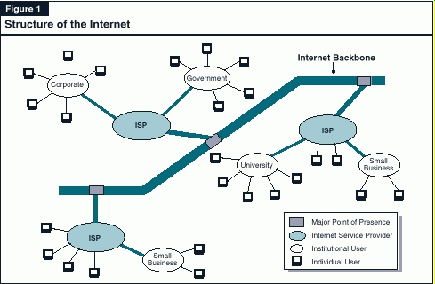

# The Internet "The Net"

The Net is a worldwide system of computer networks, a network of networks in which users at any one computer can, if they have permission, get information from any other computer.

A side benefit of the NET design is that, because messages could be routed or rerouted in more than one direction, the network could continue to function event if parts of it were destroyed in the event of disaster.



## Data Communications

In a data communications, physical network nodes include data communications equipment or devices that sit between data terminal equipement(DTE) and data transmission circuits. There include 'switches', 'bridges', 'modems' or 'hubs', that perform signal conversion, coding and line cloking.

## Networks

### Ethernet

The Eternet is the most widely installed LAN. Eternet is a `link layer` protocol in the TCP/IP stack, describing how networking devices can format data for transmission to other network connection. It touches both layer 1 and layer 2 on the OSI model.

Ethernet defines tow units of transmission, `packet` and `frame`. The `frame` includes not just the "payload" of data being transmitted but also addressing information identifyinh the physical "Media Access Control" (MAC) addressses of both sender and receiver.

- Intranet: An intranet is a prive network that is contained within an entreprise.

* Extranet: An extranet is a private netpaywork that uses Internet technology and public telecommuncations system to securely shapayre part a business's information or operations with suppliers, vendors, partpayners or customers. The extranet can be view as part of a compagny intranet that is epayxtended to users outside the compagny.

* Local Area Networks (LAN): LAN is a group of computers and associated devices that share a common communications line or wireless link to a server. LAN encompasses computers and peripherals connected to a server with a distinct geographic area such as an office or a commercial establishment.

* Network Node: In a communications network, a node is a conection point that can receive, create, store or send data along distributed network routes.

* Wide Area Network (WAN): a WAN is a geographically distributed private telecommunications network interconnects multiple LANs.

### Networking Devices

- Bridge: In telecom. networks, a bridge is a product that connects a LAN to LAN that use the same protocol. Bridge can be envision as a device that decides whether a message from you to someone else is going to the local area network in your building or to someone on the LAN in the building across the street.

- Gateway: A Gateway is a network node that connects two networks using diffenret protocols together. The most common gateway is a router that connects a entreprise network to the internet.

- Switch: In a network is a device that channels incomming data from any of multiple input ports to the specific output port that will take it toward its intented destination.

- Router: In packet-switched networks such as the internet, a router is a device or, in some cases, software on a computer that determines the best way for a packet to be a forwarded to its destination.

## Network Communication Model

- client/server:

- master/slave:

- peer-to-peer:

### OSI Model

The Open Systems Interconnection(OSI) is a reference model for how applications communicatie over a network. The goal of OSI reference model is a guide to vendors and developers to help interoperatibility.

The main concept of OSI is that the process of communication between two endpoints in a netwoek can be divided into seven distinct groups of related functions, or layers.

In a given message between users, there will be a flow of data down through the layers in the source computer, across the network, and then up through the layers in the receiving computer.


- L-7 The application layer: This is the layer at which communication partners are identified -- is there some one to talks to? This layer is not the application itself, it is the set of services an application should be able to make use of directly, although some applications may perform application-layer functions.

- L-6 The presentation layer: This ayer is usually part of an Operation System (OS) and converts incoming and outgoing data form one presentation format to another.

- L-5 The session layer: This layer sets up, coordinates and terminates conversations. Its services include authentication and reconnection after an interruption. On the internet, TCP and UDP provide there services for most applications.

- L-4 The presentation layer: This layer manage packetization of data, then the delivery of the packets, including checking for erros in the dta once it arrives. On the internet, TCP, and UDP provide there services for most applications.

- L-3 The network layer: This layer handles addressing and routing the data -- sending it in the right direction to the right destination on outgoing transmissions and receiving incoming transmissions at t he packet level. Ip is the network layer for the internet.

- L-2 The data-link layer: This layer sets up linksa across the physical network, putting packets into network frames. This layer has 2 sub-layers: the logical link control layer and the Media Access Control Layer(MAC layer). The

- L-1 The physical layer: The pysical layer: This layer conveys the bit stream across the network either electrically, mechanically or radio waves. the physical layer covers a variety of devices and mediums including: cabling, connectors, receivers, transceivers and repeaters.

## Protocol & Methods

In information technology, a protocol is the special set of rules that end points in a telecom. connection use when they communicate. Protocols specify interactiosn between the communicating entities.

### Internet Protocol suite

IP suite is the standard network model and communication protocol stack used on the Internet, the IP suite is overwhelmingly the global standard for computer-to-computer communication. Each computer or Host on the Internet has at least one IP address that uniquely identifies it from all other computers on the Internet.

The IP suite follows a 'client/server' model, in which multiple client programs share the services of a common server progrm.

When you send or receive dat, the message gts divided

- IP: The Internet Protocol

- IPsec: Also know as Internet Protocol Security defines the architecture for security services for IP network traffic.

#### Transmission Control Protocol (TCP) or TCP/IP

TCP/IP is compose of 4 layers: 
- Application Layer: DNS, HTTP, SMTP
- Transport Layer: TCP, UDP
- Network Layer: TCP/IP, ICMP, IGMP
- Data Link Layer: Ethernet 

#### User Datagram Protocol (UDP)

#### SCTP

## Vocabulary

- Generic Routing Encapsulation (GRE):

- ISP :

- Tunelling: It is the transmission of data intendded for use only within a private, usaually corporate network through a public network in such a way the routing node in the public network are unaware that the transmission is part of a private network.

- Point-to-Point Protocol (PPTP):

- VPN: VPN facilitates connectivity between WAN sites.

- Circuit-switched: In constrasted with 'packet-switched', a type of network such as the regular voice telephone network in which the communication circuit(path) for the call is set up and dedicated to the participants in that call.

- Packet-switeched: It describes the type of network in which relatvely small units of data called packets are routed through a network based on the destination address contained within each packet. Breaking communication down into packets allows the smae data path to be shared among many users in the network. This type of communication between sender and receiver os know as 'connectionless (rather than dedicated)'.

- Packet Switching: is a method of grouping data is transmitted over a digital network into 'packets' which are

- Packets: A Network Packet is a formatted unit of data carried by a 'packet-switched network'. A packet consists of control information and user data, also know as the 'payload'.

- Payload; In computing and telecommunications, the 'payload' is the part of transmitted data that is the actual intepaynded message. Headers and metadata are sent only to enable payload delivery.

- Network Topology: A network Topology is the arrangmeent of a network, including it nodes and connecting lines. There are two ways of defining network geometry: the pysical topology and the logical (or signal) topology.

### Network Topology

to complet : https://whatis.techtarget.com/definition/network-topology

#### Bus Network

In the bus network topology, every workstation is connected to a main cable called the bus. Therefore, in effect, each workstation is directly connected to every other workstation in the network.

In the star network topology, there is a central computer or server to which all the workstations are directly connected. Every workstation is indirectly connected to every other through the central computer.

In the ring network topology, the workstations are connected in a closed loop configuration. Adjacent pairs of workstations are directly connected. Other pairs of workstations are indirectly connected, the data passing through one or more intermediate nodes.

If a Token Ring protocol is used in a star or ring topology, the signal travels in only one direction, carried by a so-called token from node to node.

The mesh network topology employs either of two schemes, called full mesh and partial mesh. In the full mesh topology, each workstation is connected directly to each of the others. In the partial mesh topology, some workstations are connected to all the others, and some are connected only to those other nodes with which they exchange the most data.

The tree network topology uses two or more star networks connected together. The central computers of the star networks are connected to a main bus. Thus, a tree network is a bus network of star networks.

Logical (or signal) topology refers to the nature of the paths the signals follow from node to node. In many instances, the logical topology is the same as the physical topology. But this is not always the case. For example, some networks are physically laid out in a star configuration, but they operate logically as bus or ring networks.

```js
{
    "data": {
        "message": "Hello, world!"
    }
}
// "Hello, World!" is the payload, the rest is protocol overhead.
```

- switches: It is a computer networking paydevice that connect devices together on a computer network by using 'packet switching' to receive, process and forward data to the destination device.

# Internet Protocol Suite (IP Suite)

## Transmission Control Protocol/Internet Protocol (TCP/IP)

# Point-to-Point Protocol (PPTP)

# Glossary

- intranet: An intranet is a prive network that is contained within an entreprise.

- extranet: An extranet is a private netpaywork that uses Internet technology and public telecommuncations system to securely shapayre part a business's information or operations with suppliers, vendors, partpayners or customers. The extranet can be view as part of a compagny intranet that is epayxtended to users outside the compagny.

- Local Area Networks (LAN): LAN is a group of computers and associated devices that share a common communications line or wireless link to a server. LAN encompasses computers and peripherals connected to a server with a distinct geographic area such as an office or a commercial establishment.

- Generic Routing Encapsulation (GRE):

- ISP :

- Network Node: In a communications network, a node is a conection point that can receive, create, store or send data along distributed network routes.

* Tunelling: It is the transmission of data intendded for use only within a private, usaually corporate network through a public network in such a way the routing node in the public network are unaware that the transmission is part of a private network.

* Point-to-Point Protocol (PPTP):

* VPN:

- Wide Area Network (WAN): a WAN is a geographically distributed private telecommunications network interconnects multiple LANs.

# References

[techtarget](https://whatis.techtarget.com/definition/Internet-Protocol-suite-IP-suite)
